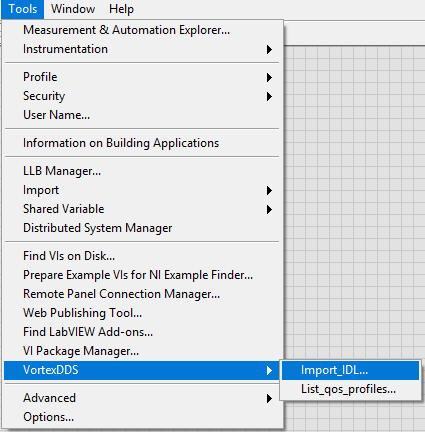
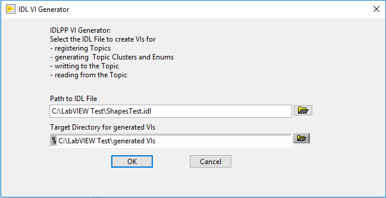
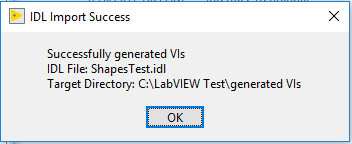
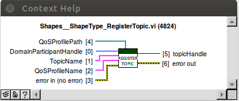
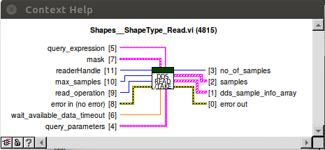
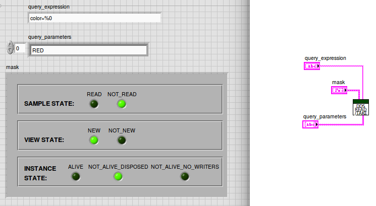
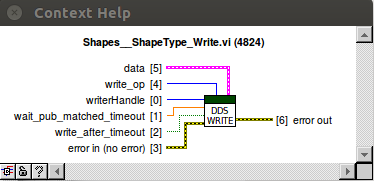

.. _`LabVIEW Generation from IDL`:

###########################
LabVIEW Generation from IDL
###########################

While creating a DDS application in LabVIEW, the user must create Topic VIs which map to DDS topic types. In addition to registering a topic, the user neeeds to create DDS Read and DDS Write VIs. LabVIEW data is represented in clusters. The DDS Read and Write VIs have terminals that require a LabVIEW cluster. On data writes, the LabVIEW clusters are converted to DDS topic types and on data reads, the DDS topic types are converted to LabVIEW clusters.

The user can generate the LabVIEW clusters and DDS VIs from an IDL file.

The DDS LabVIEW Integration supports generation of LabVIEW typedefs and VIs from IDL. This chapter describes the details of the IDL-LabVIEW binding.

Generating LabVIEW VIs from an IDL File IDLPP
*********************************************

DDS Topic Types can be described in an IDL file. The LabVIEW IDL generation is done using the **Import_IDL** Tools menu in LabVIEW.

*Tools/VortexDDS/Import_IDL*

In the IDL file, ensure that any topic structures have the OSPL specific annotation *pragma keylist* defined. This value is added as a **keylist constant** to the *key* terminal of the generated RegisterTopic.vi.

Select the IDL file and a folder for the generated VIs. 

Upon successful generation the VIs are located in the folder that was chosen. A dialog box appears indicating the path of the generated VIs and the IDL file.

.. raw:: latex

    \newpage

Generated Artifacts
*******************

The following table defines the LabVIEW artifacts generated from IDL concepts:

===========  ===============  =======================================================
IDL Concept  LabVIEW Concept  Comment
===========  ===============  =======================================================
module                        Appended to the name of each VI contained in the module 
enum         enum             a LabVIEW .ctl file.
enum value   enum value
struct       cluster          a LabVIEW .ctl file.
field        cluster field
sequence     array
array        array  
===========  ===============  =======================================================

**Datatype mappings**

The following table shows the LabVIEW equivalents to IDL primitive types:

.. table:: 

    +--------------------------+-------------------------------+
    |**DDS IDL**               |**LabVIEW Type**               |
    +==========================+===============================+
    |boolean                   |Boolean                        |
    +--------------------------+-------------------------------+
    |char                      |int8                           |
    +--------------------------+-------------------------------+
    |octet                     |uint8                          |
    +--------------------------+-------------------------------+
    |short                     |int16                          |
    +--------------------------+-------------------------------+
    |unsigned short            |uint16                         |
    +--------------------------+-------------------------------+
    |long                      |int32                          |
    +--------------------------+-------------------------------+
    |unsigned long             |uint32                         |
    +--------------------------+-------------------------------+
    |long long                 |int64                          |                                      
    +--------------------------+-------------------------------+
    |unsigned long long        |uint64                         |
    +--------------------------+-------------------------------+
    |float                     |single-precision floating point|
    +--------------------------+-------------------------------+
    |double                    |double-precision floating point|
    +--------------------------+-------------------------------+
    |string                    |String                         |
    +--------------------------+-------------------------------+
    | **Unsupported DDS data types**                           |                                               
    +--------------------------+-------------------------------+
    |wchar                     |*not supported*                |
    +--------------------------+-------------------------------+
    |wstring                   |*not supported*                |
    +--------------------------+-------------------------------+
    |any                       |*not supported*                |
    +--------------------------+-------------------------------+
    |long double               |*not supported*                |
    +--------------------------+-------------------------------+
    |union                     |*not supported*                |
    +--------------------------+-------------------------------+
    |inheritance               |*not supported*                |
    +--------------------------+-------------------------------+

**Generated VIs and controls**

For each struct in the IDL file, the following VIs and controls are generated:

- RegisterTopic.vi
- Write.vi
- Read.vi
- CicoTable.vi (Copy-in copy-out)
- Topic cluster.ctl (corresponds to each struct in IDL File)
- Enum.ctl (corresponds to each enum in IDL File)

The "moduleName_structName" is appended to the name of each VI and control that is generated. 

.. raw:: latex

    \newpage

RegisterTopic.vi
****************

The RegisterTopic.vi represents a DDS topic type. The DDS topic corresponds to a single data type. In DDS, data is distributed by publishing and subscribing topic data samples. 

============= ========= ======================= =========================== ============================
Terminal Type Optional  Name                    Description                 Output consumed by
============= ========= ======================= =========================== ============================
Input         no        DomainParticipantHandle DDS Domain Participant      
                                                entity instance 

Input         no        TopicName               DDS Topic Name

Input         yes       QosProfilePath          QoS file uri

Input         yes       QoSProfileName          Name of QoS profile

Input         yes       error in (no error)     Input Error cluster

Output        no        topicHandle             DDS Topic entity instance   create_reader.vi
                                                                            create_writer.vi

Output        yes       error out               Error out cluster           
============= ========= ======================= =========================== ============================

.. raw:: latex

    \newpage

Read.vi
*******

The DDS Read.vi is used to read DDS samples from a specific topic.  

============= ========= ======================= =========================== ============================
Terminal Type Optional  Name                    Description                 Output consumed by
============= ========= ======================= =========================== ============================
Input         no        readerHandle            DDS Reader      
                                                entity instance 

Input         yes       mask                    read_condition masks 
                                                LabVIEW cluster

Input         yes       max_samples             maximum number of samples
                                                to read

Input         yes       read_operation          READ or TAKE
                                                default operation is TAKE

Input         yes       query_expression        expression to filter
                                                samples based on a query

Input         yes       query_parameters        parameters for the query
                                                expression

Input         yes       wait_available_data     wait for data available
                        _timeout                timeout (seconds)

Input         yes       error in (no error)     Input Error cluster

Output        yes       no_of_samples           Number of samples read      user

Output        no        samples                 LabVIEW cluster             user

Output        yes       dds_sample_info_array   sample information          user      

Output        yes       error out               Error out cluster
============= ========= ======================= =========================== ============================

.. raw:: latex

    \newpage

Filters
=======

The filtering of incoming samples can happen based on a query and/or on a sample read condition(s).

**Query**

query_expression: The expression is a SQL condition.

query_parameters: Each parameter element must be an array element.

*Note: Query expressions are only validated at runtime. If they are incorrect, errors will occur while running the VI.*

**Read Condition**

The read condition mask specified will filter the samples that are read or take(n).

Example: For a reader, the Sample State has **Not Read** selected and  **Read** deselected.

Only samples with a Sample State **Not Read** will be processed with read or take.
Any samples with the **Read** sample state will not be read or take(n).

.. raw:: latex

    \newpage

Write.vi
********

The DDS Write.vi is used to write DDS samples to a specific topic. 

============= ========= ======================= =========================== ============================
Terminal Type Optional  Name                    Description                 Output consumed by
============= ========= ======================= =========================== ============================
Input         no        writerHandle            DDS Writer      
                                                entity instance 

Input         yes       write_op                write operation: WRITE,
                                                DISPOSE, WRITE_DISPOSE
                                                Default operation: WRITE 

Input         no        data                    samples LabVIEW cluster     DDS

Input         yes       wait_pub_matched        wait for publication 
                        _timeout                matched timeout (seconds)

Input         yes       write_after_timeout     write samples 
                                                after timeout

Input         yes       error in (no error)     Input Error cluster 

Output        yes       error out               Error out cluster
============= ========= ======================= =========================== ============================

