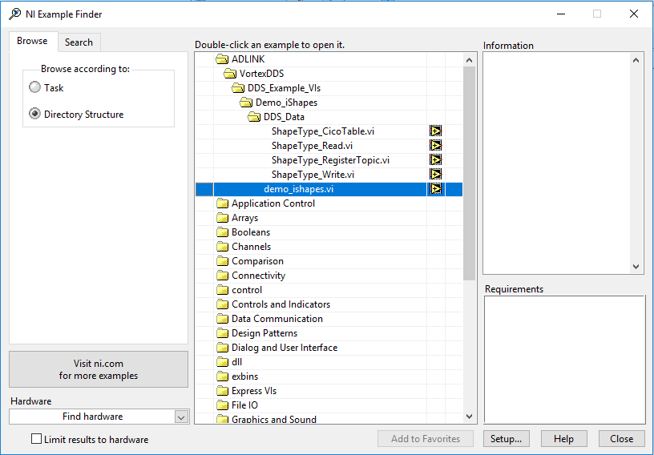
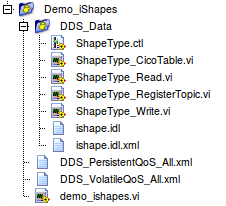
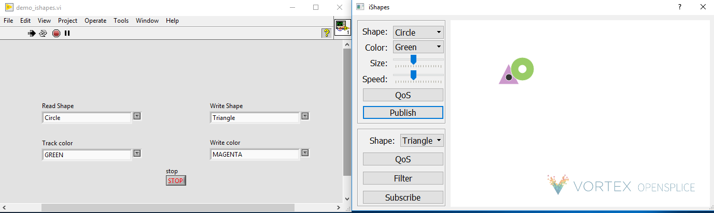

.. _`Demo iShapes Example`:

####################
Demo iShapes Example
####################

A simple demo iShapes example is provided to demonstrates the basic capabilities of the LabVIEW DDS integration. It displays DDS communication between LabVIEW and pure DDS applications.

The demo_ishapes.vi example (LabVIEW application) can be found using the **NI Example Finder** in LabVIEW:  
    

The demo_ishapes.exe (DDS application) can be found in the following directory. 

  `OSPL_HOME`/bin/demo_ishapes.exe 

.. raw:: latex

    \newpage

Example Files
*************

An explanation of what each example file does is provided below.

**DDS_Data Folder**

This folder contains the idl file and artifacts generated from idlpp process. 

**ishape.idl**

- Defines the ShapeType in idl
- Used to generate the LabVIEW DDS VIs via idlpp

**ishape.idl.xml**

- Defines the topic descriptor from idl file

**ShapeType_CicoTable.vi**

- Defines the copy-in, copy-out table information for mapping IDL to LabVIEW types 

**ShapeType.ctl**

- Defines a ShapeType cluster in LabVIEW; generated from idlpp   
- The ShapeType represents a DDS topic type
- ShapeType specifies 4 properties:  color, x, y, shapesize

**ShapeType_Read.vi**

- DDS Read ShapeType samples

**ShapeType_Write.vi**

- DDS Write ShapeType samples

**ShapeType_Topic.vi**

- DDS Register ShapeType topic

**DDS_PersistentQoS_All.xml**

- XML file that specifies the DDS QoS (quality of service) settings for RegisterTopic

**DDS_VolatileQoS_All.xml**

- XML file that specifies the DDS QoS (quality of service) settings for Reader and Writer entities

**demo_ishapes.vi**
  
- Creates a participant on the default DDS domain
- Registers a ShapeType Topic to Read and to Write to one of the three topics: Circle, Square or Triangle
- Subscribes to the shape and color from demo_ishapes.exe DDS application
- As soon as they match, demo_ishapes.vi publishes to the DDS application and follows the subscribed shape

.. raw:: latex

    \newpage

Steps to run example
********************

Steps:

1.  Open command shell and run script to setup environment variables.

     **Linux**

     - Open a Linux terminal.

     - Navigate to directory containing release.com file.

       */INSTALLDIR/ADLINK/Vortex_v2/Device/VortexOpenSplice/6.9.x/HDE/x86_64.linux*

     - Run release.com. (Type in “. release.com” at command line.)

     **Windows**

     - Open a command prompt.

     - Navigate to directory containing release.bat file.

       *INSTALLDIR/ADLINK/Vortex_v2/Device/VortexOpenSplice/6.9.x/HDE/x86_64.win64*

     - Run release.bat.   (Type in “release.bat” at command line.)

2.  Navigate to the directory that contains demo_ishapes.exe DDS application and run the application using the command shell used in Step 1.

     **Linux**

     */INSTALLDIR/ADLINK/Vortex_v2/Device/VortexOpenSplice/6.9.x/HDE/x86_64.linux/bin*

     - Run demo_ishapes.exe (Type in “./demo_ishapes.exe &” at command line)

     **Windows**

     *INSTALLDIR/ADLINK/Vortex_v2/Device/VortexOpenSplice/6.9.x/HDE/x86_64.win64/bin*

     - Run demo_ishapes.exe (Type in “demo_ishapes.exe &” at command line)

3.  Start LabVIEW using the **SAME** command shell used in Step 1. Open the demo_ishapes.vi using the **NI Example Finder** in LabVIEW.

    *NOTE:   If LabVIEW and the demo_ishapes.exe application are NOT started from a command shell with the correct OSPL environment variables set, the example will not work.*

.. raw:: latex

    \newpage

4.  In the LabVIEW demo_ishapes.vi application make the following selections:
   
    Read Shape: Circle
    Track color: GREEN

    Write Shape: Triangle
    Write color: MAGENTA

    .. figure:: images/labview_example_selection.png 
        :alt: Demo ishapes LabVIEW selection

.. raw:: latex

    \newpage

5.  In the demo_ishapes.exe DDS application make the following selections:

    Shape: Circle
    Color: Green
    Click **Publish**

    Shape: Triangle
    Click **Subscribe**

    .. figure:: images/dds_example_selection.png 
        :alt: Demo ishapes DDS application selection

6.  Run the LabVIEW demo_ishapes.vi application

7.  To stop the LabVIEW application, click on **STOP** on the front panel of the demo_ishapes.vi.

Output
******

LabVIEW application publishes samples to the DDS application. In the demo_ishapes.exe application, the Triangle follows the Circle.

