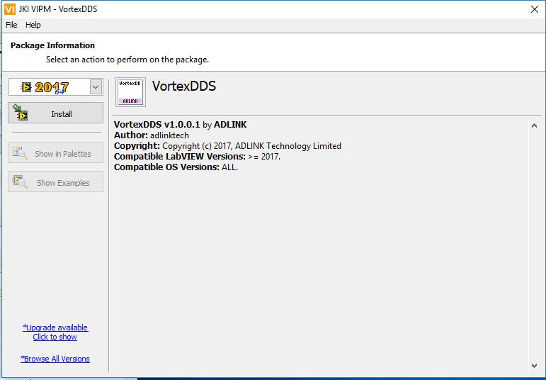

.. _`Installation`:

############
Installation
############

This section describes the procedure to install the Vortex DDS LabVIEW Integration on a Linux or Windows platform. 

System Requirements
*******************

- Operating System: Windows or Linux 
- LabVIEW 2017 installed

OpenSplice (OSPL) and DDS LabVIEW Installation
***********************************************

Steps:

1.  Install OSPL. The DDS LabVIEW Integration is included in this installer.

2.  Setup OSPL license. Copy the license.lic file into the appropriate license directory.

   */INSTALLDIR/ADLINK/Vortex_v2/license*

3.  LabVIEW installation files are contained in a tools/labview folder.

   Example:
   */INSTALLDIR/ADLINK/Vortex_v2/Device/VortexOpenSplice/6.9.x/HDE/x86_64.linux/tools/labview*

OpenSplice (OSPL) Configuration
*******************************

By default OSPL uses single process configuration.

DDS LabVIEW Installation
************************

Linux
=====

1. Open a command shell and navigate to 

   */INSTALLDIR/ADLINK/Vortex_v2/Device/VortexOpenSplice/6.9.x/HDE/x86_64.linux/tools/labview*

2. Unzip the "adlink-dds-labview-linux-install.tar.gz".

3. Run the install_vortex_dds_ubuntu.sh script as a super user.

   sudo ./install_vortex_dds_ubuntu.sh

   *NOTE:   The installer sets the default LabVIEW installation path to /usr/local/natinst/LabVIEW-2017-64.* *To override this installation directory, run the install script and pass the install directory as an argument:*

   *sudo ./install_vortex_dds_ubuntu.sh /path/to/your/LabVIEW/installation*

4. LabVIEW will open and allow the installation Virtual Instrument (VI) run to completion.

5. After the installation is complete close LabVIEW. Installation takes effect the next time you start LabVIEW.

Windows
=======

1. In a file browser, navigate to 
   
   */INSTALLDIR/ADLINK/Vortex_v2/Device/VortexOpenSplice/6.9.x/HDE/x86_64.windows/tools/labview*

2. Double click on the file “adlink_lib_vortexdds-1.0.0.1”. This will bring up the VI Package Manager installer dialog box. Select the LabVIEW version to install (32-bit or 64-bit). Select **Install**.

3. After the installation is complete close LabVIEW. Installation takes effect the next time you start LabVIEW.

.. raw:: latex

    \newpage

Running LabVIEW
***************

Steps:

1.  Open command shell and run script to setup environment variables.

     **Linux**

     - Open a Linux terminal.

     - Navigate to directory containing release.com file.

       */INSTALLDIR/ADLINK/Vortex_v2/Device/VortexOpenSplice/6.9.x/HDE/x86_64.linux*

     - Run release.com. (Type in “. release.com” at command line.)

     **Windows**

     - Open a command prompt.

     - Navigate to directory containing release.bat file.

       *INSTALLDIR/ADLINK/Vortex_v2/Device/VortexOpenSplice/6.9.x/HDE/x86_64.win64*

     - Run release.bat.   (Type in “release.bat” at command line.)

2.  Start LabVIEW using the **SAME** command shell used in Step 1.

     *NOTE:   If LabVIEW is NOT started from a command shell with the correct OSPL environment variables set, errors will occur when attempting to use DDS LabVIEW virtual instruments.*

