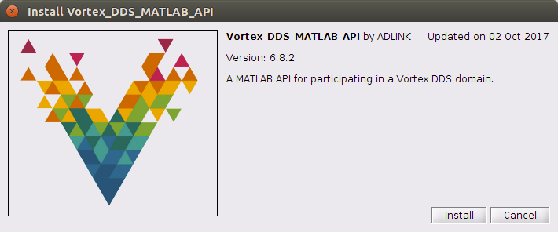

.. _`Installation`:

############
Installation
############

This section describes the procedure to install the Vortex DDS MATLAB Integration on a Linux or Windows platform. 

System Requirements
*******************

- Operating System: Windows or Linux 
- MATLAB installed
- Java 1.7 or greater

OpenSplice (OSPL) and DDS MATLAB Installation
*********************************************

Steps:

1.  Install OSPL.  The DDS MATLAB Integration is included in this installer.

2.  Setup OSPL license.  Copy the license.lic file into the appropriate license directory.

   */INSTALLDIR/Vortex_v2/license*

3.  DDS MATLAB files are contained in a tools/matlab folder

   Example:
   */INSTALLDIR/Vortex_v2/Device/VortexOpenSplice/6.8.1/HDE/x86_64.linux/tools/matlab*

MATLAB and DDS Setup
********************

Steps:

1.  Open command shell and run script to setup environment variables.

     **Linux**

     - Open a Linux terminal.

     - Navigate to directory containing release.com file.

       */INSTALLDIR/Vortex_v2/Device/VortexOpenSplice/6.8.1/HDE/x86_64.linux*

     - Run release.com.   (Type in “. release.com” at command line.)

     **Windows**

     - Open a command prompt.

     - Navigate to directory containing release.bat file.

       *INSTALLDIR/Vortex_v2/Device/VortexOpenSplice/6.8.1/HDE/x86_64.win64*

     - Run release.bat.   (Type in “release.bat” at command line.)

2.  Start MATLAB using the **SAME** command shell used in Step 1.

     *NOTE:   If MATLAB is NOT started from a command shell with the correct OSPL environment variables set, exceptions will occur when attempting to use DDS MATLAB classes.*

3.  In MATLAB, navigate to file “Vortex_DDS_MATLAB_API.mltbx” by typing::

     cd(fullfile(getenv('OSPL_HOME'),'tools','matlab'))
 
4.  Double click on the file “Vortex_DDS_MATLAB_API.mltbx”.   This will bring up a dialog entitled **Vortex_DDS_MATLAB_API**.    
    Select **Install**.

Examples
********

Example models have been provided in the examples folder.

Example:
*/INSTALLDIR/Vortex_v2/Device/VortexOpenSplice/6.8.1/HDE/x86_64.linux/tools/matlab/examples/matlab*

