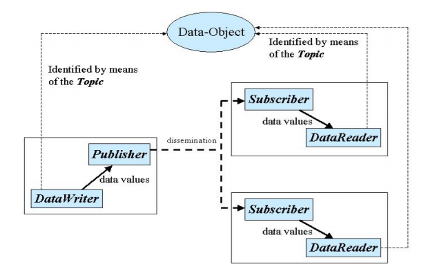

.. _`Introduction`:

############
Introduction
############

The DDS MATLAB Integration provides users with DDS MATLAB classes to model DDS communication using MATLAB and pure DDS applications.

Please refer to the DDS and MATLAB documentation for detailed information.

DDS
***

**What is DDS?**

“The Data Distribution Service (DDS™) is a middleware protocol and API standard for data-centric connectivity from the Object Management Group® (OMG®). It integrates the components of a system together, providing low-latency data connectivity, extreme reliability, and a scalable architecture that business and mission-critical Internet of Things (IoT) applications need.”

“The main goal of DDS is to share the right data at the right place at the right time, even between time-decoupled publishers and consumers. DDS implements global data space by carefully replicating relevant portions of the logically shared dataspace.”  DDS specification

**Further Documentation**

http://portals.omg.org/dds/

http://ist.adlinktech.com/

MATLAB
******

**What is MATLAB?**

"The Language of Technical Computing

Millions of engineers and scientists worldwide use MATLAB® to analyze and design the systems and products transforming our world. MATLAB is in automobile active safety systems, interplanetary spacecraft, health monitoring devices, smart power grids, and LTE cellular networks. It is used for machine learning, signal processing, image processing, computer vision, communications, computational finance, control design, robotics, and much more.

Math. Graphics. Programming.

The MATLAB platform is optimized for solving engineering and scientific problems. The matrix-based MATLAB language is the world’s most natural way to express computational mathematics. Built-in graphics make it easy to visualize and gain insights from data. A vast library of prebuilt toolboxes lets you get started right away with algorithms essential to your domain. The desktop environment invites experimentation, exploration, and discovery. These MATLAB tools and capabilities are all rigorously tested and designed to work together.

Scale. Integrate. Deploy.

MATLAB helps you take your ideas beyond the desktop. You can run your analyses on larger data sets and scale up to clusters and clouds. MATLAB code can be integrated with other languages, enabling you to deploy algorithms and applications within web, enterprise, and production systems."

https://www.mathworks.com/products/matlab.html

