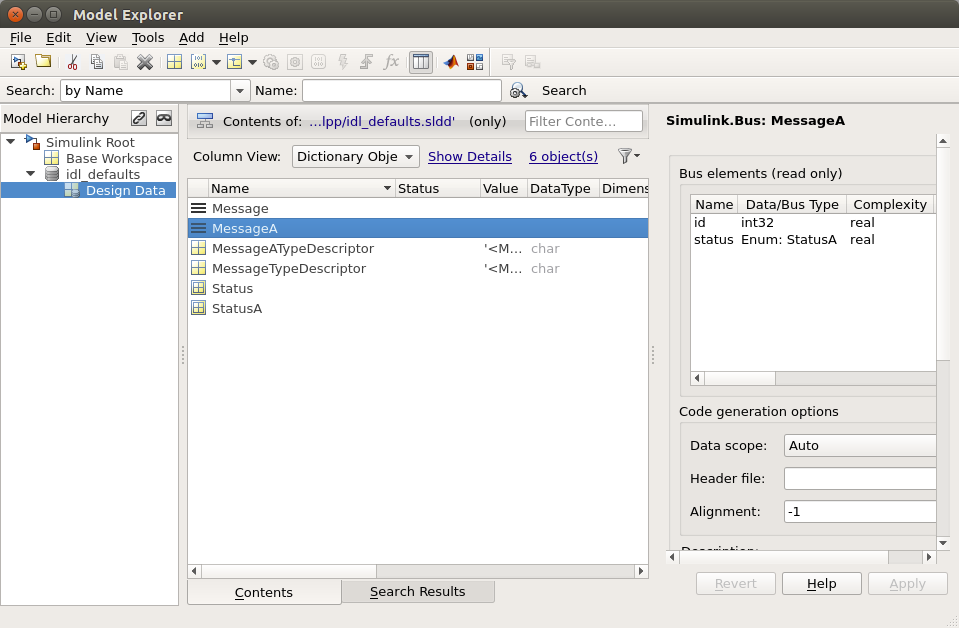

.. _`Simulink Bus to DDS Topic Mapping`:

#################################
Simulink Bus to DDS Topic Mapping
#################################

Simulink data is represented in buses whose types are not compatible with DDS topic data types.

When using the Simulink Vortex DDS library, the user must create Simulink buses that will be mapped to DDS topic types.

The Vortex DDS **Reader**, **Writer** and **Topic** blocks have block parameters that require a Simulink bus type.  On data writes, the Simulink bus types are converted to DDS topic types and on data reads, the DDS topic types are converted to Simulink bus types.

The user can generate/create the Simulink bus definitions by either generating them from an IDL file, or by using the Simulink bus editor.

Generate Simulink bus definitions from an IDL file
**************************************************

DDS Topic Types can be described in an IDL file.  The public Vortex.idlImportSl function can be called to generate Simulink bus definitions from an IDL file.

**idlImportSl(IDLFILENAME,DICTIONARYFILE)**

     Given an IDLFILENAME, invokes the idlpp tool to generate a MATLAB script.
     This script is then used to create Simulink.Bus objects and import them into the specified data dictionary DICTIONARYFILE.
     The values are inserted into the 'Design Data' section of the data dictionary.
     If the target data dictionary already contains definitions for the bus or enum names, they are overwritten.
     If idlpp returns non-zero, the function returns immediately with the error code.

          Input Arguments:

          IDLFILENAME       A character array with the value of the IDL file name to process.

          DICTIONARYFILE    A character array with the value of the data dictionary file name.

**Steps:**

1. In the IDL file, ensure that any topic structures have the OSPL specific annotation *pragma keylist* defined.

     If you want a given IDL structure to serve as the topic type, the structure requires an OSPL specific annotation.
     The #pragma keylist <data-type-name> <key>* declaration should be defined after the structure declaration.

     IMPORTANT NOTE: The IDL file has to have a blank line after the pragma keylist declaration. (BUG)

     More information can be found at: IDLPreProcGuide_

2. In MATLAB, navigate to the directory that contains the IDL file.   Set this directory to be the MATLAB **Current Folder**.

3. Call the idlImportSl function in the MATLAB command window.

     Example:
     >> Vortex.idlImportSl('ShapeType.idl', 'shape.sldd')

Overriding default values for Vortex.idlImportSl
************************************************

The ``Vortex.idlImportSl`` function makes a number assumptions when generating a Simulink data dictionary
from your IDL file. These are documented in the following table:

+-------------------------+---------------------------------+
| **IDL Element**         | **Default Simulink Equivalent** |
+=========================+=================================+
| struct name             | Unqualified bus name            |
+-------------------------+---------------------------------+
| enum name               | Unqualified enum name           |
+-------------------------+---------------------------------+
| sequence<*T*, *N*> name | *seqN_T*                        |
+-------------------------+---------------------------------+
| sequence<*T*> name      | *seq_T*                         |
+-------------------------+---------------------------------+
| unbounded string        | maximum 256 characters          |
+-------------------------+---------------------------------+
| unbounded sequence      | maximum 16 elements             |
+-------------------------+---------------------------------+

The following subsections illustrate how to override each of these defaults.

Overriding struct and enum names
++++++++++++++++++++++++++++++++

IDL allows you to describe a hierarchical set of namespaces for structs and enums by defining modules.
Simulink, however, has a flat namespace for all busses and enumerations.
This can present problems when the same unqualified struct name is used to two or more different modules.

Consider the following idl::

  module A {
    enum Status {
       INFO,
       WARNING,
       ERROR
    };
    struct Message {
        long id;
        Status status;
    };
    #pragma keylist Message id
  };

  module B {
    enum Status {
       SUCCESS,
       FAILURE
    };
    struct Message {
        long id;
        Status status;
    };
    #pragma keylist Message id
  };

In it, both ``Status`` and ``Message`` are used in the context of both module A and module B. When you run ``Vortex.idlImportSl`` against it,
you will receive the following messages::

  Error: IDL element B::Status translates to the Simulink artifact named Status,
  which already corresponds to another IDL element A::Status.
  Edit the idl_defaults.properties file to assign unique Simulink names to each IDL element.

  Error: IDL element B::Message translates to the Simulink artifact named Message,
  which already corresponds to another IDL element A::Message.
  Edit the idl_defaults.properties file to assign unique Simulink names to each IDL element.

To help you solve the problem, the IDL import function generates a *properties file* with the same name as the original IDL file, but with a *properties* extension.
Here is the generated properties file::

    # <initial comments removed for brevity>
    #
    # To change the generated Simulink element, change one or more values in this file, and then
    # re-run the IDL import.

    A::Message#name = Message
    A::Status#name = Status
    B::Message#name = Message
    B::Status#name = Status

The properties file shows the names the IDL import attempted to used. Each line is of the format::

    <qualified-IDL-name>#name = <simulink-name>

You can modify any value after the equals sign (=), to create a unique name. Once you have finished
editing the properties file, re-run the IDL import to update actual Simulink entities.

Suppose we make the following changes to the properties file::

    A::Message#name = MessageA
    A::Status#name = StatusA
    B::Message#name = Message
    B::Status#name = Status

On re-running ``Vortex.idlImportSl``, the generated Simulink data dictionary would have contents as seen in the figure below.

    *View of generated Simulink Data Dictionary, showing renamed busses and enumerations*.

Changing unbound string maximum sizes
+++++++++++++++++++++++++++++++++++++

Although IDL unbound strings can be of any length, in Simulink they are mapped to fixed length arrays of int8.
The default length the ``Vortex.idlImportSl`` assigns to such arrays is 256 characters.
You can change this default value, per string, using the generated properties file.

Suppose we modify A::Message to contain a string field::

    module A {
        enum Status {
           INFO,
           WARNING,
           ERROR
        };
        struct Message {
            long id;
            Status status;
            string body;
        };
        #pragma keylist Message id
    };

On running the IDL import, the properties file would be updated to show a new line::

    A::Message.body#stringMax = 256

Changes the value to something new (say 128), and rerun the IDL import to update the generated Simulink bus.

Changing sequence attributes
++++++++++++++++++++++++++++

IDL import generates a simulink bus for each IDL sequence discovered. For an unbound sequence, the default
name for such sequences is *seq_T*, where *T* is the type of elements in the sequence.
For bounded sequences, the default sequence name is *seqN_T*, where *N* is the declared upper bound of the sequence.

The following IDL enhances our example IDL to use a sequence of string field for the body attribute::

    module A {
        enum Status {
           INFO,
           WARNING,
           ERROR
        };
        struct Message {
            long id;
            Status status;
            sequence<string> body;
        };
        #pragma keylist Message id
    };

On running IDL import, the generated property file now contains the following lines::

    A::Message.seq_string#name = seq_string
    A::Message.seq_string#seqMax = 16
    A::Message.seq_string#stringMax = 256

You can edit the value of ``A::Message.seq_string#name`` to change the name of the generated Simulink bus representing the sequences.
You can change the maximum number of elements stored in the Simulink representation of the sequence by editing ``A::Message.seq_string#seqMax``.
Finally, because the type of elements in this sequence are unbounded strings, you can also change the maximum size of each string in the sequence (``A::Message.seq_string#stringMax``).

Add Simulink bus definitions using bus editor
*********************************************

Users can also model the Simulink buses using the Simulink bus editor.

Please see :ref:`Tutorial` for an example with detailed steps.

Bus definition limitations
**************************

The DDS Simulink integration has some limitations.  Provided below is a table of unsupported types.
Some of these bus definition limitations will be removed in later release(s).

Please refer to :ref:`Appendix A` for more detailed implementation details.

    +-------------------------------+
    |Unsupported Simulink Types     |
    +===============================+
    | long long                     |
    +-------------------------------+
    | unsigned long long            |
    +-------------------------------+
    | wchar                         |
    +-------------------------------+
    | wstring                       |
    +-------------------------------+
    | any                           |
    +-------------------------------+
    | long double                   |
    +-------------------------------+
    | union                         |
    +-------------------------------+
    | inheritance                   |
    +-------------------------------+

See also IDL PreProcessor Guide chapter Keys.

