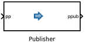
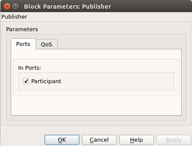

.. _`Publisher Block`:

###############
Publisher Block
###############

The Publisher block represents a DDS publisher entity.

In DDS, a publisher is "an object responsible for data distribution.  It may publish data of different data types."

This block is optional on a DDS Simulink model diagram.    If it is not present on a model diagram, each writer will create a default publisher.

=========== ========= ======= =========================== ====================
  Port Type  Optional Name    Description                 Output consumed by
=========== ========= ======= =========================== ====================
Input       yes       pp      DDS Domain Participant      
                              entity instance             
Output      no        ppub    DDS Publisher entity        Writer
                              instance   
=========== ========= ======= =========================== ====================

Publisher Block Parameters
**************************

Ports Tab
=========
The **Ports** tab allows the user to toggle on or off optional ports.

QoS Tab
=======
The **QoS** tab is used to set the QoS profile.   By default, the OSPL default profile is used.

In DDS - The Data-Distribution Service (DDS) relies on the usage of QoS.  A QoS (Quality of Service) is a set of characteristics that controls some aspect of the behavior of the DDS Service.

Each DDS block has an associated QoS profile.   By default, the OSPL default profile is used.  An XML file that specifies QoS profiles can be used to set the QoS of a DDS block.

