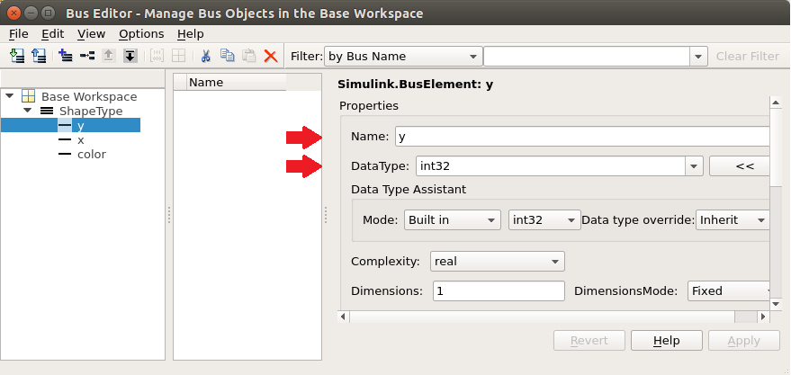
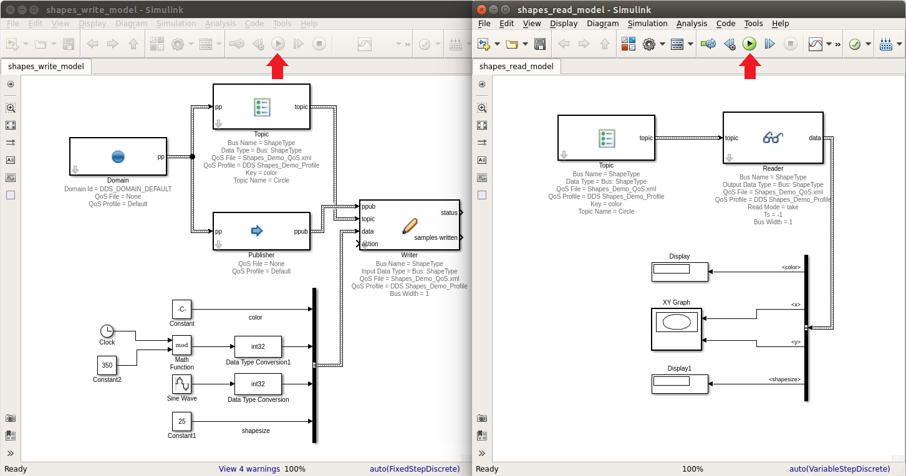

.. _`Tutorial`:

########
Tutorial
########

To demonstrate the capabilities of the DDS Simulink Integration, this tutorial will create two Simulink models.    One model will write DDS samples, and the second model will read the DDS samples. 

Both models will be run simultaneously, and use a DDS system for communication.

A Simulink bus named ShapeType is created as part of this tutorial.   The bus can be created by either using the Simulink bus editor, or by generation from an IDL file.
Both options are covered in this tutorial.

Create ShapeType Bus Using Simulink Bus Editor
**********************************************

Buses define the data which will be published and read. Both the read and write Simulink models will make use of a bus to read and write sample data.   

For this tutorial, we will create a BUS named **ShapeType**.  

Open the bus editor from the MATLAB command window
==================================================

.. figure:: images/openBusEditor.png 
        :alt: Open Bus Editor

Add a new BUS named ShapeType
=============================

Select Add Bus button
---------------------

Set Bus name and Key
-------------------------

- Set the new bus name to: **ShapeType**.
- Set Description to: @Key(color).  This sets the Topic key.
- Select **Apply** button to save.

.. figure:: images/addShapeType.png 
        :alt: Bus Name

Note: If the Key is not set, the topic block's Key annotation in the model will be shown empty and it will result in a keyless topic. Keyless topics have only one instance.

Add BusElements
===============

The **ShapeType** bus will have 4 bus elements:  color, x, y and shapesize. 

A BusElement can be added to the ShapeType bus by selecting the **Add/Insert BusElement** button.

A BusElement can be moved up or down using the **Move Element Up** and **Move Element Down** buttons.  

.. raw:: latex

    \newpage

Add color
---------

- Select **Add/Insert BusElement** button
- Set name to: color
- Set DataType to: uint8
- Set Dimensions to: 10
- Set Description to: @String
- Select **Apply** to save

.. figure:: images/colorBusElement.png 
        :alt: BusElement color

Note: This creates a DDS 'string' type. Bus elements of type 'int8' or 'uint8' with an annotation of @String in the Description field define a DDS string. Dimension set to 10 means Simulink is going to read only the first ten bytes of the string. You can also use the '\@BString' annotation to define a DDS bounded string. The dimension of the field is treated as the maximum string size.

.. raw:: latex

    \newpage

Add x
-----

- Select **Add/Insert BusElement** button
- Set name to: x
- Set DataType to: int32
- Select **Apply** to save

Add y
-----

- Select **Add/Insert BusElement** button
- Set name to: y
- Set DataType to: int32
- Select **Apply** to save

.. raw:: latex

    \newpage

Add shapesize
-------------

- Select **Add/Insert BusElement** button
- Set name to: shapesize
- Set DataType to: int32
- Select **Apply** to save

Export BUS objects
==================

When bus objects are added to the MATLAB workspace, they will be lost on MATLAB close or workspace clear.   To persist the bus objects, they can be exported.  

A quick way to export the **ShapeType** bus using the bus editor, is to right click on the bus and select **Export ShapeType to File…**

The **ShapeType** bus is complete.

Create ShapeType Using IDL
****************************

The public Vortex.idlImportSl function can be called to generate Simulink bus definitions from an IDL file.   
The generated bus definitions are inserted into the 'Design Data' section of a data dictionary.

From the Simulink documentation - 
     *"A data dictionary is a persistent repository of data that are relevant to your model. You can also use the base workspace to store design data that are used by your model during simulation."*

The data dictionary can then be referenced from your models.

Create IDL File
===============

Create an IDL file to define your ShapeType topic structure.   For this tutorial we will name the file *ShapeType.idl*.

.. code-block:: idl

    struct ShapeType {
      string color; //@Key
      long x;
      long y;
      long shapesize;
    };
   #pragma keylist ShapeType color

IMPORTANT NOTE: The IDL file has to have a blank line after the pragma keylist declaration. (known bug)

Generate Simulink bus definitions from an IDL file
==================================================

Steps:

1.  In MATLAB, navigate to the directory that contains the *ShapeType.idl* file.   Set this directory to be the MATLAB **Current Folder**.

2.  Call the idlImportSl function in the MATLAB command window. 

     >> Vortex.idlImportSl('ShapeType.idl', 'shape.sldd')

     where:

        'ShapeType.idl' is the name of the IDL file

        'shape.sldd' is the name of the target data dictionary for the generated bus definitions

.. raw:: latex

    \newpage

Model Explorer
==============

To make use of the bus definitions generated into the data dictionary, Simulink models can specify design data using the **Model Explorer**.

.. figure:: images/modelExplorer.png 
        :alt: Model Explorer Design Data

Shapes Write Model
******************

This section outlines how to create a new DDS Simulink model that will write sample data for the topic type **ShapeType**. 

Although not necessary, this model will use the optional Domain and Publisher blocks.

Create a new Simulink model
===========================

Start Simulink
--------------

.. figure:: images/startSimulink.png 
        :alt: Start Simulink

.. raw:: latex

    \newpage

Add a new blank model
---------------------

Save As...
----------

- Save the model as *“shapes_write_model.slx”*.

.. raw:: latex

    \newpage

Model Settings
--------------

- Open Model Configuration Parameters dialog, by selecting menu **Simulation / Model Configuration Parameters**.

- Set the simulation stop time to 1000.0 seconds. (Note: “Simulation time is not the same as clock time. For example, running a simulation for 10 seconds usually does not take 10 seconds. Total simulation time depends on factors such as model complexity, solver step sizes, and computer speed.”  Simulink Help documentation)

- Set the Solver Type to Fixed-step.

Add Simulink DDS Blocks
=======================

Open the Simulink Library Browser
---------------------------------

- Open the Simulink Library Browser

- Browse to and select **Vortex DDS** to view DDS custom blocks

.. figure:: images/ddsLibrary.png 
        :alt: Vortex DDS Blocks

.. raw:: latex

    \newpage

Add a Domain block
------------------

- Drag a Domain participant block from the Simulink Library Browser onto the Simulink model diagram.

Set domain block properties
---------------------------

- To set a block’s parameters, double click on the block to bring up the **Block Parameters** dialog.
- The domain id is read only and set to DDS_DOMAIN_DEFAULT.   This default is specified in the OSPL configuration file.
- The **QoS** tab defaults to the OSPL defaults.
- For this tutorial example, we are going to use the defaults, therefore no block parameters need to be specified.

Add blocks (Topic, Publisher, and Writer)
-----------------------------------------------------

Using the Simulink Library Browser drag the following block types onto your diagram:   
    - 1 Topic
    - 1 Publisher
    - 1 Writer

.. raw:: latex

    \newpage

Connect Domain to Topic and Publisher
-------------------------------------

- Connect the Domain **pp** output to Topic **pp** input.
- Connect the Domain **pp** output to Publisher **pp** input.

.. raw:: latex

    \newpage

Set Topic Block Parameters
--------------------------

- Double click on the Topic to bring up the **Block Parameters** dialog.
- In the **Topic** tab:
     - Set **Bus Type** to: ShapeType
     - Set **Topic Name** to: Circle
- The **Ports** tab allows for the setting of optional ports.  For this model, we will not change the defaults.
- Select the **QoS** tab.
- Set the QoS file to: Shapes_Demo_QoS.xml.  
     /INSTALLDIR/ADLINK/Vortex_v2/Device/VortexOpenSplice/6.8.x/HDE/x86_64.linux/tools/matlab/
          /examples/simulink/dds_reader_writer_model/Shapes_Demo_QoS.xml

.. figure:: images/write_topic_parameters.png 
        :alt: Set Topic Block Parameters

.. raw:: latex

    \newpage

Connect Topic, Publisher and Writer Blocks & Set Writer Block Parameters
------------------------------------------------------------------------

- Connect the Topic **topic** output to the Writer **topic** input.
- Connect the Publisher **ppub** output to the Writer **ppub** input.

- Double click on the Writer block to edit the **Block Parameters**.    Set the **Input Data Type** to the bus: ShapeType.
- Select the Writer **QoS** tab.
- Set the QoS file to: Shapes_Demo_QoS.xml.
  
     - /INSTALLDIR/ADLINK/Vortex_v2/Device/VortexOpenSplice/6.8.x/HDE/x86_64.linux/tools/matlab/
          /examples/simulink/dds_reader_writer_model/Shapes_Demo_QoS.xml

.. figure:: images/writer_write_parameters.png 
        :alt: Connect Blocks

.. raw:: latex

    \newpage

Add a Bus Creator to Set Sample Data
------------------------------------

To generate sample data, we will add a **Simulink / Signal Routing / BusCreator** block to our diagram.

.. figure:: images/write_buscreator_params.png 
        :alt: Set Bus Creator Block Parameters

Add Bus Creator Inputs
----------------------

For demonstration purposes, we will input to the **BusCreator** signals using **Constant**, **Clock** and **Sine Wave** blocks.

Note:  To change the positioning of block ports, you can use the **Rotate & Flip** block menu item, accessible by right clicking on a block.

     - Drag 2 **Simulink / Sources / Constant** blocks onto the diagram
     - Connect one **Constant** block to color input signal
     - Connect one **Constant** block to shapesize input signal

.. raw:: latex

    \newpage

- Set the **Block Parameters** for color signal **Constant** block
- Set **Constant value** to:  uint8(pad('GREEN',10,'right', char( 0 ) ))
- Select **OK**

.. raw:: latex

    \newpage

- Set the **Block Parameters** for shapesize signal **Constant** block
- Set **Constant value** to:  25
- Set **Output data type** to:  int32

- Drag a **Simulink / Sources / Sine Wave** block onto diagram
- Connect **Sine Wave** block to y input signal
- Drag a **Simulink / Signal Attributes / Data Type Conversion** block onto **Sine Wave** connector.
- Set **Output data type** to: int32

.. raw:: latex

    \newpage

- Set **Block Parameters** for **Sine Wave** block.
- Set **Amplitude** to: 150
- Set **Bias** to: 175
- Set **Sample time** to: 0.5

- For the **x** input signal, drag 3 new blocks onto diagram: 
            - **Simulink / Sources / Constant** 
            - **Simulink / Sources / Clock** 
            - **Simulink / Math Operations / Math Function**

- Set **Block Parameters** for **Math Function** block.
- Set **Function** to: mod
- Set **Output signal type** to: real

.. figure:: images/write_mathFunctionBlockParams.png 
        :alt: Math Function Block Parameters

.. raw:: latex

    \newpage

- Set **Block Parameters** for **Constant** block.
- Set **Constant value** to: 350

- Connect the **Clock** and **Constant** blocks to the mod **Math Function**
- Connect the mod **Math Function** to the **BusCreator** x input signal

.. figure:: images/modBlock.png 
        :alt: Connect mod block

.. raw:: latex

    \newpage

- Drag a **Simulink / Signal Attributes / Data Type Conversion** block onto **Math Function** connector.
- Set **Output data type** to: int32

**Save your model.   Your model is now complete!**

Shapes Read Model
*****************

Create a new Simulink model
===========================

This section outlines how to create a new DDS Simulink model that will read and display sample data for the topic type **ShapeType**. 

In this model example, we will be making use of many of the defaults, so the optional blocks will not be included in this model.

.. raw:: latex

    \newpage

Start Simulink
--------------

.. figure:: images/startSimulink.png 
        :alt: Start Simulink

Add a new blank model
---------------------

Save As...
----------

- Save the model as *“shapes_read_model.slx”*.

.. raw:: latex

    \newpage

Model Settings
--------------

- Open Model Configuration Parameters dialog, by selecting menu **Simulation / Model Configuration Parameters**.

- Set the simulation stop time to **inf**. (Note: “Specify inf to run a simulation or generated program until you explicitly pause or stop it.”  Simulink Help documentation)

- Set the Solver Type to **Fixed-step**.

.. figure:: images/read_model_settings.png 
        :alt: Setup Read Model

.. raw:: latex

    \newpage

Add Simulink DDS Blocks
=======================

Open the Simulink Library Browser
---------------------------------

.. figure:: images/ddsLibrary.png 
        :alt: Vortex DDS Library

Add all required blocks (Topic and Reader)
------------------------------------------

Using the Simulink Library Browser drag the following block types onto your diagram:   
     - 1 Topic
     - 1 Reader

Note: For this example model, we will be using the block defaults for the Domain and Subscriber, therefore they will not be included on the model.

To set a block’s parameters, double click on the block to bring up the **Block Parameters** dialog.

.. figure:: images/read_blocks.png 
        :alt: Add Blocks

Toggle off optional ports
-------------------------

- Double click on the Topic to bring up the **Block Parameters** dialog.
- In the Topic **Ports** tab deselect the Participant port.

- Double click on the Reader to bring up the **Block Parameters** dialog.
- In the Reader **Ports** tab deselect the Subscriber, Reader, Status, Info and Samples Read ports.

.. raw:: latex

    \newpage

Set Topic Block Parameters
--------------------------

- Double click on the Topic to bring up the **Block Parameters** dialog, select **Topic** tab.
- Set the **Bus Type**: ShapeType bus 
     Note:  If the ShapeType bus is not displayed, select Refresh data types from dropdown list.
- Set the **Topic Name** to: Circle.

.. figure:: images/read_topic_topic.png 
        :alt: Topic Block Parameters

- Select the **QoS** tab.
- Set the QoS file to : Shapes_Demo_QoS.xml.  
     INSTALLDIR/ADLINK/Vortex_v2/Device/VortexOpenSplice/6.8.x/HDE/x86_64.linux/tools/matlab/
        examples/simulink/dds_reader_writer_model/Shapes_Demo_QoS.xml

Set Reader Block Parameters
---------------------------

- Double click on the Reader block to edit the **Block Parameters**.    Set the **Input Data Type** to the bus: ShapeType.
- Select the **QoS** tab.
- Set the QoS file to : Shapes_Demo_QoS.xml. 
     INSTALLDIR/ADLINK/Vortex_v2/Device/VortexOpenSplice/6.8.x/HDE/x86_64.linux/tools/matlab/
        examples/simulink/dds_reader_writer_model/Shapes_Demo_QoS.xml

.. raw:: latex

    \newpage

Connect Topic and Reader
------------------------

- Connect the Topic block **topic** output to the Reader block **topic** input.

.. figure:: images/read_connect.png 
        :alt: Connect Topic and Reader

Add a Bus Selector to read and display sample data
--------------------------------------------------

To read and display sample data, we will add a **Simulink / Signal Routing / Bus Selector** block to our diagram.

Set Bus Selector Block Parameters
---------------------------------

Specify the output signals we would like to display in our simulation.  For this example, we will display all the ShapeType BUS signals in the running simulation.

- Connect the Reader **data** output to the **Bus Selector**.
- Double click on the **Bus Selector** block to edit the **Block Parameters**.
- Add all the signals in the bus to the **Selected signals**.

.. figure:: images/read_busSelectorOutputs.png 
        :alt: Bus Selector Block Parameters

.. raw:: latex

    \newpage

Add Bus Selector outputs
------------------------

For demonstration purposes, we will output the bus signals using 2 Simulink **Display** blocks and an **XY Graph**.

Note:  To change the positioning of block ports, you can use the **Rotate & Flip** block menu item, accessible by right clicking on a block.

- Drag 2 **Simulink / Sinks / Display** blocks onto the diagram.
- Connect the **Display** blocks to the **Bus Selector** output signals.
     - Connect the Bus Selector color output signal to a Display block.
     - Connect the Bus Selector shapesize output signal to a Display block.

Note:   Default Display block settings used.

.. raw:: latex

    \newpage

- Drag **Simulink / Sinks / XY Graph** block onto diagram
- Connect the **BusSelector** x and y outputs to the **XY Graph** block.
- Set the Block Parameters on the **XY Graph**:
     X-min: 0
     X-max: 400
     Y-min: 0
     Y-max: 400

.. figure:: images/xyGraph2.png 
        :alt: Bus Selector XY Graph

**Save your model!!!   The model is now complete!**

.. raw:: latex

    \newpage

Running Simulations
*******************

We now have two Simulink models.    We will run both models and see that data samples are being written by one model and read be the second model.   

Setup Write Model
=================

1.	Open shapes_write_model.slx.
2.	Select menu item **Simulation / Update Diagram** to diagnose any possible model problems.
3.	Fix any issues.

Setup Read Model
================

1.	Open shapes_read_model.slx.
2.	Select menu item **Simulation / Update Diagram** to diagnose any possible model problems.
3.	Fix any issues.

Run Simulations
===============

1.	Position models side by side.
2.	Start the read model simulation.
3.	Start the write model simulation.
4.	Expected:   The write model will write samples, that are received by the read model and displayed in that model’s **XY Graph** and **Display** blocks.
5.	The write model will run to completion.   The read model needs to be stopped manually.

.. raw:: latex

    \newpage

**Run Results**

.. figure:: images/results.png 
        :alt: Run results

