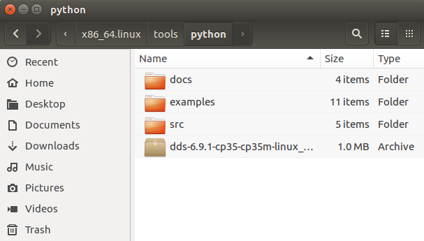

.. _`Installation`:

############
Installation
############

This section describes the procedure to install the Python DCPS API on a Linux or Windows platform. 

System Requirements
*******************

Operating System: Linux or Windows

Dependencies
************

 **Linux**
     - Python3 version 3.4.0 or later
     - pip3 (package "python3-pip" on most linux package managers)
     - GCC 4.8 or later

 **Windows**
     - Python version 3.5.0
     - pip (usually already included in Python for Windows)
     - Visual Studio 14 (2015) C compiler or later

 **Python modules**
     - Cython version 0.27 or later (install using "pip3 install Cython")

OpenSplice (OSPL) and Python DCPS API Installation
***************************************************

Steps:

1.  Install OSPL.  The Python DCPS API is included in this installer.

2.  Setup OSPL license.  Copy the license.lic file into the appropriate license directory.

   */INSTALLDIR/Vortex_v2/license*

3.  Python DCPS API files are contained in a tools/python folder

   Example:
   *$OSPL_HOME/tools/python*

.. _PythonDCPSAPI:

Python DCPS API Setup
*********************

Install Python DCPS API package from python wheel
=================================================

In certain Vortex OpenSplice installs, the python api is bundled as a python wheel file in
the $OSPL_HOME/tools/python directory. This way it avoids needing a native compiler and Cython
prerequisites before installation.

Simply install using pip. For example, executing the command will install the wheel package,
which is targeted for python 3.4 64-bit Linux:

    $pip3 install dds-6.9.0-cp34-cp34m-linux_x86_64.whl

Or similarly, for python 3.5 64-bit Windows:

    >pip install dds-6.9.0-cp35-cp35m-win_amd64.whl

If the binary wheel package is not present or is not compatible with your python version,
then it is preferable to install the api from source.

Install Python DCPS API package from source
===========================================

If the dependencies are satisfied, and the Vortex OpenSplice environment is set
(OSPL_HOME and associated environment variables), then installation is just one command
to execute in the $OSPL_HOME/python/src directory:

    $python3 setup.py install

.. note:: 

    - In either case, installing from wheel or from source may require administrator or superuser privileges if python was installed for all users. 

    - To check modules are installed correctly try importing the installed modules.

       >>> import dds
       >>> import ddsutil

Examples and Documentation
**************************

1.  Examples  

      The examples can be found in the following directory:

         - *$OSPL_HOME/tools/python/examples*

2.  Python DCPS API Documentation  

      The Python DCPS API can be found in the following directory:

         - *$OSPL_HOME/tools/python/docs/html*

3.  Python DCPS User Guide (HTML and PDF)

      The user guide can be found in the following directories:

         - *$OSPL_HOME/docs/html*

         - *$OSPL_HOME/docs/pdf*

